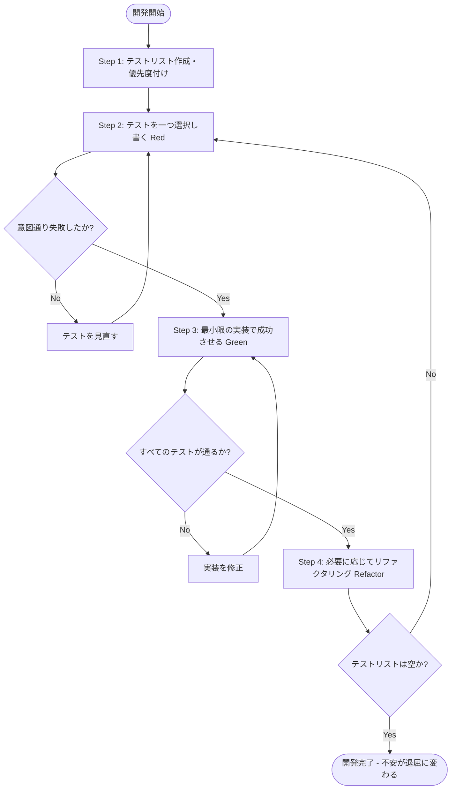

# t-wada 流 厳密 TDD (Canon Test-Driven Development) 指針

本スキルは、Kent Beck が定義した「Canon TDD（標準 TDD）」および和田卓人氏（t-wada）の流儀・思想に基づき、開発プロセスにおいて**厳密なテスト駆動開発（TDD）**を実践するための包括的ガイドです。

---

## 1. TDD の目的と基本理念

### 目的
TDD の目的は、プログラマを支援し、システムを以下の状態へ導くことです：
1. **回帰の防止**: それまで動作していた機能は引き続きすべて動作する。
2. **仕様の満足**: 新しい振る舞いが期待通りに動作する。
3. **保守性の向上**: システムがさらなる変更の準備ができている（リファクタリングによる内部品質の維持）。
4. **心理的安全性**: プログラマと同僚が、上記の点について強い**根拠ある自信（Confidence）**を持っている。

### 概念の明確な分離（誤解の排除）
* **自動テスト (Automated Test)**: テスティングフレームワークを用いたテストコードおよびその実行。
* **開発者テスト (Developer Testing)**: 開発者が自らテストを書きながら開発を進めること（タイミングは実装後でも可）。
* **テスト駆動開発 (TDD)**: 単に「テストを先に書く」ことではなく、**テストリストの作成・インターフェイスと実装の分離・フィードバックサイクルの回旋**によって駆動される厳密な開発ワークフロー。

### インターフェイスと実装の分離
設計を2つの相に明確に分離します：
* **インターフェイス設計**: 「その振る舞いはどう呼び出されるべきか」（テストコード作成時に決定）。
* **実装設計**: 「システムはその振る舞いを内部でどう実現すべきか」（Green 後のリファクタリング時に決定）。

---

## 2. TODO リスト（テストリスト）の作成と分析設計

TDD の第1ステップである「テストリストの作成」は、要求される振る舞いを小さく単純な要素に分解する段階的詳細化（タスク分解）です。

### 1. FizzBuzz 問題を題材とした TODO リスト作成例

**問題文**:
> 1から100までの数をプリントするプログラムを書け。ただし、3の倍数のときは数の代わりに「Fizz」と、5の倍数のときは「Buzz」とプリントし、3と5両方の倍数の場合には「FizzBuzz」とプリントすること。

**初期の TODO リスト**:
```markdown
- [ ] 数を文字列に変換する (1 -> "1")
- [ ] 3の倍数のときは数の代わりに「Fizz」に変換する (3 -> "Fizz")
- [ ] 5の倍数のときは数の代わりに「Buzz」に変換する (5 -> "Buzz")
- [ ] 3と5両方の倍数のときは数の代わりに「FizzBuzz」に変換する (15 -> "FizzBuzz")
- [ ] 1からnまで
- [ ] 1から100まで
- [ ] プリントする (標準出力への出力)
```

### 2. テスト容易性 (Testability) と重要度による優先度付け

タスクを以下の2軸で分類し、**「テスト容易性：高 × 重要度：高」のコアロジックから着手**します。

| カテゴリ | 対象タスク | 方針・アプローチ |
| :--- | :--- | :--- |
| **テスト容易性：高 / 重要度：高** | `数を文字列に変換する`<br>`3の倍数 -> Fizz`<br>`5の倍数 -> Buzz`<br>`3と5の倍数 -> FizzBuzz` | **最優先で TDD サイクルを回す**。<br>純粋な値入力と戻り値の振る舞い（コアなドメインロジック）。 |
| **テスト容易性：低 / 重要度：低〜中** | `プリントする (標準出力)`<br>`1から100まで (ループ)` | **後回しにする**。<br>I/O や標準出力など外部依存がある部分はテスト容易性が低いため、コアロジック完了後に分離して薄く実装するか、必要に応じて結合テストでカバーする (Humble Object パターン)。 |

### 3. テスト容易性を支える 3 要素
1. **観測容易性 (Observability)**: 結果や振る舞いがテストコードから調べやすいか（例: 戻り値を返す関数は観測容易性が高い。標準出力プリントやDB書き込みは低い）。
2. **制御容易性 (Controllability)**: テストコードから簡単に動かせるか（例: 外部APIや時刻依存がない純粋関数は制御容易性が高い）。
3. **対象の小ささ (Small Scope)**: 関数・モジュールが小さく限定されているか。

### 4. TODO リストに対する心得（最重要）
* **「最初に作った TODO リストはだいたい間違っている」**:
  * 最初から完璧なリストを作ろうと長時間を浪費しない（ざっくりした叩き台から始める）。
* **フィードバックによる動的更新**:
  * コードを書きテストを走らせる中で、「このエッジケースが漏れていた」「この設計は扱いづらい」というフィードバックが必ず得られる。
  * **得られた気づきに応じて、TODO リストの項目・順序・構造を躊躇なく柔軟に書き換える**。

---

## 3. 厳密な TDD ワークフロー (Canon TDD 5ステップ)

TDD は Red-Green-Refactor の3ステップではなく、**「リスト → レッド → グリーン → リファクタリング」**の5ステップ・ワークフローです。



### Step 1. テストリスト (Test List) の作成
* 要求される振る舞いを分析し、TODO リストを作成。テスト容易性が高く重要度の高い項目から順序づける。

### Step 2. ひとつテストを書く (Red)
* テストリストから**「ひとつだけ」**項目を選び、AAA (Given-When-Then) 構造で自動テストを書く。
* **必ずテストを実行し、期待通りの理由で失敗すること（Red）を確認する**。

### Step 3. テストを成功させる (Green)
* **「まずは動かす（Make it work）」**: 最小限のコード（仮実装含む）で成功させる。
* リファクタリングを絶対に混在させない。
* 新たな懸念やケースに気づいたら、即座に **TODO リストへ追記**する。
* 成功したら TODO リストの該当項目にチェックを入れる (`- [x]`)。

### Step 4. 必要に応じてリファクタリングを行う (Refactor)
* テストがすべて成功している（Green）安全な状態で、内部設計を改善する。
* 「重複はヒントであり、指令ではない（早すぎる抽象化の防止）」。

### Step 5. ループと完了判定
* TODO リストが空になり、「不安が退屈に変わるまで」、Step 2 〜 Step 4 を繰り返す。

---

## 4. t-wada 流「歩幅の調整 (Baby Steps / Stride)」

TDD において、進展の歩幅（Baby Steps）を柔軟にコントロールすることは極めて重要な技巧です。

### 1. 仮実装 (Fake it till you make it)
* **概要**: 定数（ベタ書きの値）を返すなどして速やかに Green にする。
* **目的**: テストコード自体の妥当性と実行パスを通すことの確認。

### 2. 明白な実装 (Obvious Implementation)
* **概要**: ロジックが明白で間違いようがない場合、一気に正しい実装を書く。

### 3. 三角測量 (Triangulation)
* **概要**: 抽象化・一般化に迷う場合、**2つ以上の異なるテストケースを追加**し、それらを通すようにコードを汎用化する。
  - FizzBuzz例:
    1. `convert(3) -> "Fizz"` に対し `return "Fizz";` (仮実装)
    2. `convert(6) -> "Fizz"` を追加し、`if (number % 3 == 0) return "Fizz";` へ一般化させる。

---

## 5. 「2つの帽子 (Two Hats)」原則とアンチパターン

### 「2つの帽子」原則
* **機能を動かす帽子 (Adding Functionality)**: テストを通過させることだけに集中する。
* **整理する帽子 (Refactoring)**: Green の状態で、コード構造の綺麗さだけに集中する。
* **ゴールデンルール**: **2つの帽子を同時にかぶって作業してはならない。**

### TDD アンチパターン（厳禁事項）

| アンチパターン | 理由・問題点 | 厳密な TDD での正しい対応 |
| :--- | :--- | :--- |
| **テストコードを一気に大量作成する** | フィードバックサイクルが破綻し、設計変更時に大量のテスト修正が発生。 | テストリスト（テキスト）を作成し、テストコード化は常に**ひとつずつ**行う。 |
| **テストリストを作らずいきなりコードを書く** | 全体像を見失い、インクリメンタルな設計が破綻する。 | 必ず最初にテキスト形式で**テストリストを作成・可視化**する。 |
| **Red (失敗) を確認せずにプロダクトコードを書く** | テストが本当に失敗するか確認できず、テストの信頼性が失われる。 | テスト追加後は**必ずテストを実行し失敗を確認**してからプロダクトコードを書く。 |
| **Green にする途中でリファクタリングを始める** | 「帽子」を同時にかぶり、エラー原因の特定が困難になる。 | まず泥臭くても Green にし、**Green になってから**リファクタリングする。 |
| **実行結果の出力をテストの期待値にコピペする** | テストによる検証（ダブルチェック）にならず、バグを見逃す。 | 期待値は要求仕様から導き出し、実行結果のコピペは行わない。 |

---

## 6. エージェント実行プロトコル (Agent Execution Protocol)

AI Agent（Antigravity）がユーザーと共に TDD を実施する際は、以下のプロトコルに従って進めてください。

### フェーズ 1: テストリストの提示と合意
1. タスク開始時、まずユーザーに**テストリスト (TODO リスト)** を提示する。
2. 観測容易性・制御容易性を考慮し、優先度の高い（テストしやすいコアな）項目から順序付ける。

### フェーズ 2: サイクル実行（1項目ずつ）
1. **[Red]**:
   - リストから1項目を選び、テストコードを1つ追加。
   - **テスト実行コマンドを提案/実行し、失敗（Red）をログで明示**。
2. **[Green]**:
   - 最小限の実装（必要に応じて仮実装）を行い、テストを実行。
   - **すべてのテスト成功（Green）をログで明示**。
   - 気づいた追加ケースがあれば TODO リストへ追記し、完了項目に `- [x]` をつける。
3. **[Refactor]**:
   - コードの重複、命名、可読性を改善し、再度テスト実行で **Green であることを明示**。

---

## 7. 既存・レガシーコードへの対応（仕様化テスト）

仕様書が無くテストも存在しないコードに遭遇した場合は、以下のアプローチをとります：
* **仕様化テスト (Characterization Test)**:
  - TO BE（あるべき仕様）ではなく **AS IS（現状の挙動）** を記録・検証するテストを書く。
  - まずシステム全体を外側から粗く E2E / インテグレーションテストで包み、安全にリファクタリングできる状態を作ってから、テスト容易性の高いユニットテストへ徐々に移行させる（*アイスクリームコーンからのテストピラミッド*）。

---

## 参考資料
* 和田卓人, [『テスト駆動開発のはじめの一歩｜t_wadaさんに聞く1人で始める自動テストのコツと考え方』](https://agilejourney.uzabase.com/entry/2023/11/30/103000) (Agile Journey)
* Kent Beck, *"Canon TDD"* (2023) / 和田卓人 訳 [『【翻訳】テスト駆動開発の定義』](https://t-wada.hatenablog.jp/entry/canon-tdd-by-kent-beck)
* レバテックLAB, [『TDDは「開発者テストのTips集」t-wada氏が改めてひも解く“本質”』](https://levtech.jp/media/article/interview/detail_477/)
* Kent Beck, 『テスト駆動開発』 (和田卓人 訳, オーム社)
